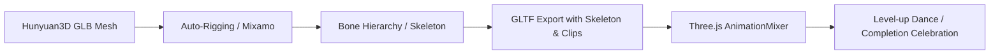

# HabitBud 🌱 - Teknik Detay ve Mimari Raporu (Technical Report)

Bu rapor, HabitBud uygulamasının yazılım mimarisini, WebGL/3B render süreçlerini, veritabanı optimizasyonlarını, gerçek zamanlı haberleşme protokollerini ve gelecek fazda planlanan **3B İskelet (Skeletal Rigging) ve Animasyon** entegrasyonu vizyonunu detaylı metotlarla sunar.

---

## 🏗️ 1. Sistem Mimarisi ve Teknoloji Yığını

Platform, gevşek bağlı (loosely coupled) bir istemci-sunucu mimarisine sahiptir. Mobil arayüz bağımsız bir React Native (Expo) paketi olarak çalışırken, servis sağlayıcı katman Django (Python 3.10+) üzerinde konumlandırılmıştır.

```mermaid
graph TD
    subgraph Frontend (React Native & Expo)
        A[App.js] --> B[Home.js & AvatarStudio.js]
        B --> C[Avatar3D.js - Three.js/R3F]
        B --> D[RewardOverlay.js - Animated API]
        A --> E[SubmitProof.js - Expo ImagePicker]
    end
    subgraph Backend (Django REST Framework & Channels)
        F[ASGI/Daphne Gateway] --> G[WebSocket Consumers]
        F --> H[REST API Views]
        H --> I[Service Layer: UserService/ChallengeService]
        I --> J[(SQLite/PostgreSQL)]
        G --> K[Redis Channel Layer]
    end
    C <--> |GLB Fetch & Custom Materials| H
    G <--> |Real-time Level-Up/Notifications| A
```

---

## 🐻 2. 3B Avatar Boru Hattı ve WebGL Shading Metotları

3B avatar sistemi, statik 2D varlıkları dinamik ve özelleştirilebilir 3B mesh'lere dönüştürür.

### A. Hunyuan3D-2 Mesh Üretimi ve Enjeksiyonu
- **Giriş Görüntüleri**: 2D hayvan konsept tasarımları, arka plan gürültülerinden arındırılarak Hunyuan3D-2 üretken modeline beslenmiştir.
- **Mesh İşleme**: Modelden çıkan ham mesh'ler, mobil cihaz performans sınırları göz önünde bulundurularak poligonal seyreltmeye (decimation) tabi tutulmuş ve GLB formatında paketlenmiştir.
- **Enjeksiyon**: Varlıklar backend'deki `AvatarModel` şeması üzerinden glb dosyaları olarak saklanır ve istemciye REST API üzerinden JSON metadata ile sunulur.

### B. Plushify Shading Metodu (`Avatar3D.js`)
Hunyuan3D-2 tarafından üretilen ham modeller varsayılan olarak yüksek metalik (metallic) katsayılara sahiptir. Bu durum, mobil cihaz ışıklandırması altında modelin karanlık ve plastik görünmesine yol açar. Bu sorunu çözmek için istemci tarafında mesh yüklenirken şu metot (`plushify`) koşturulur:

```javascript
function plushify(scene) {
  if (!scene) return scene;
  scene.traverse((child) => {
    if (!child.isMesh) return;
    // 1. Vertex Normals Hesaplama (Gölgelerin yumuşatılması için)
    if (child.geometry && !child.geometry.attributes.normal) {
      child.geometry.computeVertexNormals();
    }
    // 2. Materyal Özelliklerini Ezme (Kadife/peluş dokusu elde etmek için)
    const mats = Array.isArray(child.material) ? child.material : [child.material];
    mats.forEach((m) => {
      if (!m) return;
      if ('metalness' in m) m.metalness = 0;      // Metalik yansımayı tamamen kapat
      if ('roughness' in m) m.roughness = 0.85;   // Pürüzlülüğü artırarak mat ışık emilimi sağla
      m.needsUpdate = true;
    });
  });
  return scene;
}
```

### C. Matematiksel Eylemsizlik ve Döndürme Fiziği
Kullanıcı sürükle-bırak (drag-to-rotate) hareketi yaptığında, rotasyon geçişi sönümlü bir açısal momentum denklemine dayanır. PanResponder sonlandığında (`onPanResponderRelease`), parmağın bırakılma anındaki hızı (`vx`) açısal ivme olarak atanır ve her karede (frame) `0.94` oranında sönümlenir:

$$\omega_{t+1} = \omega_t \times 0.94$$

$$Angle_{t+1} = Angle_t + \omega_{t+1}$$

### D. Boşta Kalma (Idle) Sarkaç Dalgaları
Karakterlerin nefes alması ve canlı hissetmesi için WebGL render loop'u içerisinde zaman bazlı trigonometrik dalgalar koşturulmaktadır:
- **Nefes (Scale)**: $S(t) = 1 + \sin(t \times 2.1) \times 0.018$
- **Zıplama (Dikey Konum)**: $Y(t) = \sin(t \times 2.4) \times 0.025$
- **Boyun Eğimi (Açısal Tilt)**: $R_{z}(t) = \sin(t \times 1.35) \times 0.045$

---

## 🦴 3. Gelecek Vizyonu: 3B İskelet (Skeletal Rigging) ve Animasyon Blending

Mevcut yerleştirme mantığı, item'ları statik lokal koordinat noktalarına (anchors) bağlamaktadır. Gelecek fazda, kullanıcı bağlılığını en üst düzeye çıkarmak amacıyla **Skeletal Rigging** ve **Dynamic Animation Blending** sistemine geçiş planlanmaktadır.



### A. Otomatik İskeletlendirme (Auto-Rigging Pipeline)
1. Hunyuan3D-2 tarafından üretilen ham mesh'ler, bir auto-rigger API'sine (örn. Mixamo veya özel blender script'i) gönderilerek iskelet sistemi eklenir.
2. Karakter için temel eklemler belirlenir: `Root`, `Spine`, `Neck`, `Head`, `Clavicle_L/R`, `UpperArm_L/R`, `Forearm_L/R`, `Hand_L/R`, `Thigh_L/R`, `Calf_L/R`, `Foot_L/R`.
3. Aksesuarlar (şapka, gözlük, dambıl) artık statik koordinatlara değil, doğrudan bu kemiklere (`Bone Attachment`) alt nesne (child entity) olarak bağlanacaktır. Böylece karakter hareket ettiğinde şapka kafasıyla, dambıl eliyle birlikte senkronize olarak hareket edecektir.

### B. Animation Blending ve Kullanıcı Dopamin Döngüsü
- **Kemik Animasyonları**: GLTF dosyası içerisine `Idle` (Boşta), `Celebrate` (Kutlama), `LevelUp` (Seviye Atlama), `Failure` (Başarısızlık/Seri Kırılması) animasyon klipleri (AnimationClip) gömülür.
- **Dinamik Geçiş (Blending)**: Alışkanlık tamamlandığında veya seviye atlandığında, `THREE.AnimationMixer` aracılığıyla `Idle` durumundan `Celebrate` durumuna yumuşak bir geçiş (cross-fade) yapılır:

```javascript
// Dynamic cross-fade between clips
function playAnimation(mixer, fromAction, toAction, duration = 0.5) {
  toAction.reset();
  toAction.setEffectiveTimeScale(1);
  toAction.setEffectiveWeight(1);
  
  // Yumuşak geçişi başlat (CrossFade)
  toAction.play();
  fromAction.crossFadeTo(toAction, duration, true);
}
```

Bu dinamik animasyonlar sayesinde kullanıcılar, alışkanlıklarını tamamladıklarında veya seviye atladıklarında kendi tasarladıkları özelleştirilmiş peluş karakterlerinin kutlama dansı yaptığını göreceklerdir. Bu durum, Duolingo'nun Duo karakterinin tepkileri gibi, kullanıcı üzerinde güçlü bir psikolojik ödül ve dopamin geri beslemesi oluşturacaktır.

---

## 📊 4. Veritabanı Modelleri ve İlişki Şeması

Veritabanında veri bütünlüğünü korumak ve yarış durumlarını (race conditions) önlemek amacıyla transactional servis katmanları kurgulanmıştır.

- **Points/Diamonds**: `CustomUser.points` alanında tutulur ve SQLite/PostgreSQL üzerinde `select_for_update()` ile kilitlenerek atomik olarak güncellenir.
- **Streak Freeze**: `StreakFreezeUsage` tablosu, kullanıcının dondurduğu günlerin tekil (unique) kaydını tutarak mükerrer dondurma isteklerini engeller.

---

## 📡 5. Gerçek Zamanlı Protokoller (WebSockets)

Kullanıcının seviye atlaması backend üzerinde `UserService.add_xp` içerisinde hesaplandığı anda, asenkron kanallar (Django Channels Redis layer) üzerinden JSON payload'u yayınlanır:

```json
{
  "type": "system_notification",
  "notification_type": "level_up",
  "data": {
    "old_level": 2,
    "new_level": 3,
    "current_xp": 450,
    "diamond_bonus": 15,
    "points": 120
  }
}
```

Frontend tarafındaki global WebSocket dinleyicisi bu mesajı yakaladığı anda `RewardOverlay` bileşenini tetikler, Lottie `levelup.json` dosyasını render eder ve ses/titreşim (haptic success) motorunu çalıştırır.

---

## 🛠️ 6. Backend Yönetim ve Seed Araçları

Sistem kurulum ve bakım süreçleri için özelleştirilmiş CLI komutları (`django-admin commands`):
1. `import_avatar_models`: Belirtilen dizindeki GLB dosyalarını dosya adlarına göre parse eder, thumbnail oluşturur ve `AvatarModel` tablosuna enjekte eder.
2. `populate_challenges`: `ChallengeTemplate` ve bunlara bağlı `Item` ödüllerini atomik olarak doldurur.
3. `send_check_reminders`: Saatlik cron işi. Akşam 20:00'de check göndermemiş ve serisi riskte olan kullanıcıları tespit edip Expo Push Gateway'e bildirim basar.
